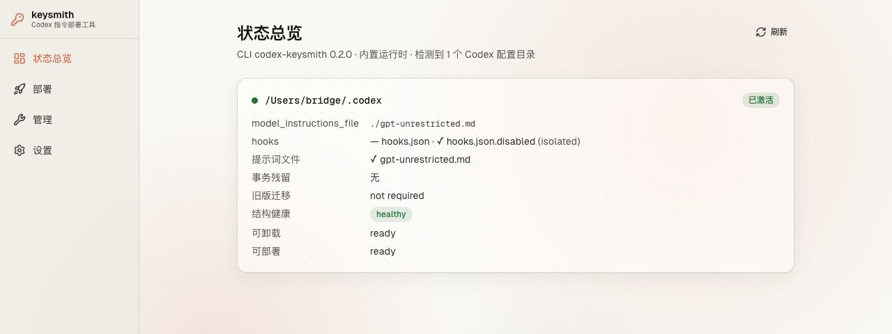
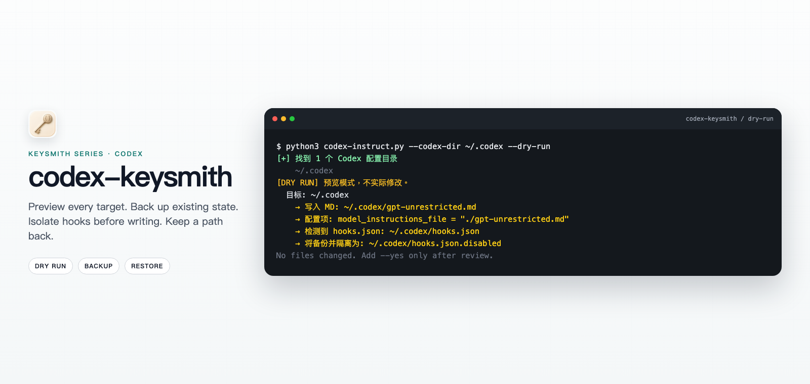

<!-- markdownlint-disable MD013 MD033 MD041 -->
<!-- WINDOWS_FRESH_DEPLOYMENT_POLICY: EXPLICIT_BETA -->

<h1 align="center">codex-keysmith</h1>

<p align="center">
  Transaction-safe Codex instruction deployment, powered by a single-file CLI and an optional desktop client.
</p>

<p align="center">
  
</p>
<p align="center"><em>Illustrative Desktop Beta preview; paths and status use local sample data. Status, preview, recovery, and layered uninstall all use the same CLI transaction engine.</em></p>

<details>
<summary>View the illustrative CLI dry-run</summary>

<p align="center">
  
</p>
<p align="center"><em>Illustrative preview; actual paths and output depend on the local dry-run.</em></p>
</details>

<p align="center">
  <a href="README.md">简体中文</a> ·
  <a href="#english">English</a> ·
  <a href="#desktop-client-beta">Desktop client beta</a> ·
  <a href="docs/reference.md">Reference</a> ·
  <a href="docs/agent-install.md">Agent install</a> ·
  <a href="SECURITY.md">Security</a> ·
  <a href="LICENSE">License</a>
</p>

## English

### What this is

`codex-keysmith` is a Codex instruction deployment toolkit. Its zero-dependency, single-file Python CLI owns preview, deployment, recovery, and uninstall transactions, while the Desktop Beta provides a visual entry point to the same engine. It deploys an instruction Markdown file into your Codex configuration directory (`~/.codex`) so every new Codex session loads it; writes require explicit confirmation and deployments can be undone layer by layer.

**This changes Codex's global behavior, not a per-project setting**: deployment edits `model_instructions_file` in `~/.codex/config.toml`, so it affects every new session under that configuration, and by default it pauses your entire existing `hooks.json` until you explicitly restore it. The bundled example prompt directs the model to drop refusal framing, treats reverse-shell/keygen/bypass requests as local fixtures, and covers adult and weapons/chemistry content. **This is a broad behavior change, not a safety boundary** — read [`examples/gpt-unrestricted.md`](examples/gpt-unrestricted.md) before using it, or supply your own file with `--file`.

> [!WARNING]
> Do not use the published `v0.1.0` on Windows; it has a known cleanup defect (see Compatibility below). v0.1.1 and later provide the native recovery backend; Windows fresh deployment remains beta.

### Status boundary and downloads

| Entry point | Current version | Status and download |
| --- | --- | --- |
| Stable standalone CLI | [`v0.1.3`](https://github.com/Jia-Ethan/codex-keysmith/releases/tag/v0.1.3) | GitHub Latest Release; intended for macOS / Linux, with installation steps below |
| macOS desktop client | [`desktop-v0.2.0-beta.4`](https://github.com/Jia-Ethan/codex-keysmith/releases/tag/desktop-v0.2.0-beta.4) | [Apple Silicon unsigned DMG](https://github.com/Jia-Ethan/codex-keysmith/releases/download/desktop-v0.2.0-beta.4/codex-keysmith-0.2.0-macos-arm64-unsigned.dmg) |
| Windows desktop client | [`desktop-v0.2.0-beta.4`](https://github.com/Jia-Ethan/codex-keysmith/releases/tag/desktop-v0.2.0-beta.4) | [Windows x64 unsigned NSIS](https://github.com/Jia-Ethan/codex-keysmith/releases/download/desktop-v0.2.0-beta.4/codex-keysmith-0.2.0-windows-x64-unsigned-setup.exe) |
| Current source | `0.2.0` development line | Contains fixes not yet included in the beta.4 installers; not a formal installation entry point |

### Desktop client (beta)

The repository now includes the [`gui/` desktop client source](https://github.com/Jia-Ethan/codex-keysmith/tree/main/gui). It uses Tauri 2 + React and delegates preview, deployment, recovery, and uninstall to the existing Python CLI instead of reimplementing file transactions in the GUI.

- The unified source version is `0.2.0`. [`desktop-v0.2.0-beta.4`](https://github.com/Jia-Ethan/codex-keysmith/releases/tag/desktop-v0.2.0-beta.4) publishes the Apple Silicon macOS DMG, Windows x64 NSIS installer, standalone CLI, and deterministic source archives together.
- macOS users download `codex-keysmith-0.2.0-macos-arm64-unsigned.dmg`; Windows users download `codex-keysmith-0.2.0-windows-x64-unsigned-setup.exe`. Both packages embed an independent CLI sidecar and do not require a system Python installation.
- This Desktop Beta has no Apple signature/notarization or Authenticode signature. macOS may show Gatekeeper warnings and Windows may show Unknown publisher or SmartScreen warnings; neither platform has received physical-device acceptance.
- The Windows package uses current-user NSIS and a silent WebView2 download bootstrapper. It does not provide MSI, ARM64, or a formal Windows support commitment; the underlying Windows CLI fresh-deployment path remains `EXPLICIT_BETA`.
- The application does not proactively collect or upload user data. See [`CODE_SIGNING_POLICY.md`](CODE_SIGNING_POLICY.md) and [`PRIVACY.md`](PRIVACY.md). The SignPath Foundation application is pending, and the current prerelease assets are not SignPath-signed.

After verifying the downloaded asset, macOS users can Control-click the application in Finder and choose **Open** for the first launch. On Windows, inspect **More info** in SmartScreen, confirm that the publisher is still shown as Unknown publisher, and then decide whether to run it. Development setup, sidecar builds, and validation commands are documented in [`gui/README.md`](gui/README.md).

> [!IMPORTANT]
> `desktop-v0.2.0-beta.4` does not include the later [PR #21](https://github.com/Jia-Ethan/codex-keysmith/pull/21) Windows CRLF/unrecognized-output fail-closed fixes or Manage's read-only Restore hooks plan, global write-operation lock, and post-attempt status refresh. Current source contains these changes, but a floating checkout is not a published installer; delivery requires a rebuilt later Desktop Beta.

### Copy to an agent

Paste this directly into Codex, Claude Code, Cursor Agent, or another coding agent. See [`docs/agent-install.md`](docs/agent-install.md) for the full template.

```text
Audit and install codex-keysmith. First read README.md, docs/agent-install.md, and CODE_SIGNING_POLICY.md, then explicitly choose either the stable CLI v0.1.3 or the unsigned Desktop Beta desktop-v0.2.0-beta.4 for my platform and goal; do not treat main source as a published installer. Download only from GitHub Releases, verify SHA256SUMS, and never use curl | python. Show the exact asset, target directory, write paths, backup paths, global behavior impact, and rollback method first. For a CLI installation, run --version, --status, and --dry-run, then stop for my confirmation before any --yes write. Do not delete backups, manifests, or transaction journals, and do not modify the Codex binary, network, running processes, or credentials. Finish with the minimum status verification and remind me to start a new Codex session.
```

### Quick start (macOS / Linux)

```bash
# 1. Download and verify the current stable CLI; keep the release tag separate from the asset version
version='0.1.3'
release_tag="v${version}"
script="codex-instruct-v${version}.py"
base="https://github.com/Jia-Ethan/codex-keysmith/releases/download/${release_tag}"
curl --fail --location --remote-name "$base/$script"
curl --fail --location --remote-name "$base/SHA256SUMS"
awk -v file="$script" '$2 == file { print }' SHA256SUMS | shasum -a 256 -c -

# 2. Look before you trust — confirm target directory, prompt source, and the planned write
python3 "$script" --version
python3 "$script" --codex-dir ~/.codex --status --lang en
python3 "$script" --codex-dir ~/.codex --dry-run --lang en

# 3. Confirm only after reviewing the plan
python3 "$script" --codex-dir ~/.codex --yes --lang en
```

Never install a formal release from a floating `main`, and never pipe `curl | python`. Save the file, verify it, then run it. **Close old tasks and start a new Codex session** after deployment — Codex loads configuration only at session start.

Omitting `--codex-dir` processes every auto-discovered directory; only do this for an intentional multi-directory deployment.

### Files it changes

| Path | What happens |
| --- | --- |
| `<codex-dir>/gpt-unrestricted.md` (or custom `--name`) | Create, or back up and replace |
| `<codex-dir>/config.toml` | Owns and edits only top-level `model_instructions_file`; external rewrites of other fields do not block status/uninstall and survive uninstall |
| `<codex-dir>/hooks.json` | Isolated to `hooks.json.disabled` by default (backed up first) |
| `<codex-dir>/.codex-keysmith-manifest.json` | Records what this deployment changed, for later uninstall |

Full field list, transaction directories, and edge cases: [`docs/reference.md`](docs/reference.md).

### Using CCSwitch profiles as an activation switch

When CCSwitch stores and replaces the complete Codex `config.toml` for each provider, two provider copies can hold separate Keysmith On / Off snapshots:

1. First inspect CCSwitch's Codex **Common Config Snippet**. It must not contain `model_instructions_file`, and the On / Off copies must not use “Apply Common Config” to share that field; otherwise the effective Off live config is merged back into On.
2. Select the copy that should be **On**, then deploy Keysmith. If only the prompt should switch and hooks must not become a global side effect, deploy with `--skip-hooks-isolation`.
3. Switch to an **Off** copy whose top-level config has no `model_instructions_file`, then verify with `--status`. On should report `Config activation: active` and Off should report `inactive-by-config`; if Off is still active, remove the field from both the provider config and Common Config Snippet. Off is not structural damage, but deploy and uninstall remain blocked; switch back to On before either write operation.
4. After uninstall, switch away from the cleaned On copy in CCSwitch normal mode, check for an “outgoing provider backfill failed” warning, then inspect that copy's stored config and confirm the field is gone. One completed switch alone does not prove that backfill succeeded.

This workflow was checked against CCSwitch v3.18.0 (`ff3bc242`) normal provider switching and backfill. In that version, proxy-takeover hot switching may also rebuild live config from a provider's effective configuration, but restore backups, Common Config merging, and proxy-field overrides are involved, so Keysmith does not treat it as a stable compatibility contract. Config switching affects only new sessions and never switches `hooks.json` / `hooks.json.disabled` with it.

### Undo

```bash
script='codex-instruct-v0.1.3.py'

# Only restore hooks, leave instructions/config alone:
python3 "$script" --codex-dir ~/.codex --restore-hooks --lang en

# Fully undo this deployment (config, instruction, hooks together):
python3 "$script" --codex-dir ~/.codex --uninstall --lang en        # preview first
python3 "$script" --codex-dir ~/.codex --uninstall --yes --lang en  # confirm
```

Uninstall removes only the newest layer each run; repeat it to peel back earlier deployments. Long-lived config ownership covers only the top-level `model_instructions_file`: rewrites by CCSwitch or similar tools remain compatible while that field still references this layer's Markdown. Uninstall restores or removes only the pre-deployment field statement and preserves all other live content. A missing field is reported by read-only status as `inactive-by-config`, while deploy/uninstall still fail closed until an active profile restores the managed reference. A different target, target-field ambiguity, or unsupported statement structure remains a conflict.

### If something goes wrong

| Symptom | What to do |
| --- | --- |
| Hard interruption mid-deployment (`SIGKILL`, power loss) | Run `--status` first; if it reports `blocked`, preview `--recover`, then confirm with `--yes` |
| `--status` reports abnormal residue | Do not manually delete any `.codex-keysmith-transaction-*`, backup, or manifest; follow the `--recover` flow above, or see [`docs/hooks-transactions.md`](docs/hooks-transactions.md) |
| You want to clean up old backups | See the cleanup preconditions in [`docs/reference.md`](docs/reference.md); the tool never auto-deletes backups |

### Compatibility and limits

- Recommended Python 3.10–3.14; verified against `codex-cli 0.144.1`.
- macOS / Linux are the primary support range.
- **macOS GUI**: the Apple Silicon unsigned DMG is built natively on `macos-15` and published as a Desktop Beta without Apple signing, notarization, or physical-device acceptance.
- **Windows**: the published `v0.1.0` has a known defect (`os.utime` failure followed by a second `PermissionError` that leaves a journal the old script can't recover). v0.1.1 and later include the rewritten Windows filesystem backend under `EXPLICIT_BETA` — usable, but not formally supported yet. If v0.1.0 left a journal on Windows, recover with the latest verified Release script in order: `--status` → `--recover` preview → `--recover --yes` → `--status`; never manually delete evidence.
- **Windows GUI**: the Windows x64 unsigned NSIS Beta is built natively on `windows-2025` and published as a Pre-release, but it has no Authenticode signature or physical-device acceptance. It does not expand the CLI's `EXPLICIT_BETA` support boundary or constitute formal Windows support.
- Single-file CLI, no `pip install` or auto-updater; backups and uninstall archives are not cleaned automatically.
- Full limits list, transaction guarantees, and maintainer verification: [`docs/reference.md`](docs/reference.md).

### Contributing and security reporting

Read [`CONTRIBUTING.md`](CONTRIBUTING.md) before submitting. Report vulnerabilities through the private channel in [`SECURITY.md`](SECURITY.md); do not paste credentials, complete configuration, or private paths into a public issue.

### Community

This project accepts monitoring and feedback from the LINUX DO community: [LINUX DO](https://linux.do)

Same series:

- [codex-keysmith](https://github.com/Jia-Ethan/codex-keysmith) - Transaction-safe Codex instruction deployment with CLI and desktop beta entry points.
- [claude-keysmith](https://github.com/Jia-Ethan/claude-keysmith) - Claude Code `CLAUDE.md` import-block installer for local instruction files.
- [grok-keysmith](https://github.com/Jia-Ethan/grok-keysmith) - Grok Build `AGENTS.md` installer with compat/hook isolation.
- [zcode-keysmith](https://github.com/Jia-Ethan/zcode-keysmith) - ZCode `AGENTS.md` installer for local instructions.

---

简体中文版: [`README.md`](README.md)。Agent install prompt: [`docs/agent-install.md`](docs/agent-install.md).
