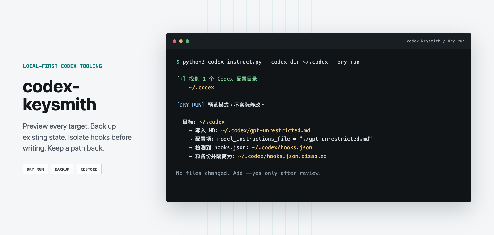
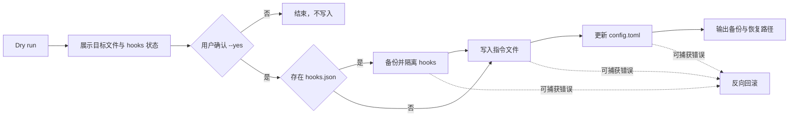

<!-- markdownlint-disable MD013 MD033 MD041 -->

<p align="center">
  
</p>

<h1 align="center">codex-keysmith</h1>

<p align="center">
  Version-independent Codex instruction deployment with preview, backups, hook isolation, and recovery.
</p>

<p align="center">
  <a href="#简体中文">简体中文</a> ·
  <a href="#english">English</a> ·
  <a href="CONTRIBUTING.md">Contributing</a> ·
  <a href="SECURITY.md">Security</a> ·
  <a href="LICENSE">License</a>
</p>

<p align="center">
  <a href="https://github.com/Jia-Ethan/codex-keysmith/actions/workflows/tests.yml"></a>
  
  
  
</p>

> [!IMPORTANT]
> **Status boundary / 状态边界**
>
> `codex-keysmith` writes one Markdown instruction file into each selected or auto-discovered Codex configuration directory and updates the top-level `model_instructions_file` setting when needed. A confirmed deployment also backs up and isolates an active `hooks.json` as `hooks.json.disabled`; every hook in that file remains paused until restored. The tool does not patch Codex binaries, intercept network traffic, or store credentials. The bundled prompt is an example, and model behavior remains version-dependent.
>
> `codex-keysmith` 会向每个明确指定或自动发现的 Codex 配置目录写入一份 Markdown 指令文件，并在需要时更新顶层 `model_instructions_file`。确认部署后，如果检测到活跃的 `hooks.json`，工具会先备份，再隔离为 `hooks.json.disabled`；该文件中的全部 hooks 会暂停，直到手动恢复。工具不修改 Codex 二进制，不劫持网络，也不保存凭证。内置提示词只是默认示例，实际模型表现仍会随版本变化。

## 复制给智能体安装

把下面这段话复制到 Codex、Claude Code、Cursor Agent 或其他智能体：

```text
请使用 https://github.com/Jia-Ethan/codex-keysmith 帮我部署 Codex 本地指令文件。先阅读 README、脚本和测试，只运行 --dry-run；报告目标 .codex 目录、将写入的 MD、config.toml 变更、hooks.json 状态、备份路径和恢复命令，等我确认后才使用 --yes。完成后核对指令文件、model_instructions_file 和 hooks.json.disabled，并保留全部备份。不要修改 Codex 二进制、网络或运行中进程，也不要记录 token、cookie 或私密配置。
```

## 友链 / Community

本项目接受 LINUX DO 社区佬友监督与反馈：[LINUX DO](https://linux.do)

同系列项目 / Same series:

- [codex-keysmith](https://github.com/Jia-Ethan/codex-keysmith) - Codex CLI instruction-file deployment for local configuration.
- [claude-keysmith](https://github.com/Jia-Ethan/claude-keysmith) - Claude Code `CLAUDE.md` import-block installer for local instruction files.
- [zcode-keysmith](https://github.com/Jia-Ethan/zcode-keysmith) - ZCode `AGENTS.md` installer for local instructions.

## Why this exists / 为什么做这个工具

手动复制一份 Markdown，再改一行 `config.toml`，看起来不复杂。真正容易出问题的是已有文件、多个 Codex 目录、会继续注入上下文的 hooks，以及写入中断后的恢复路径。`codex-keysmith` 把这些步骤变成一次可以先预览、再确认、可回退的本地部署。

Copying a Markdown file and editing one TOML key is simple. Existing files, multiple Codex directories, active hooks, concurrent changes, and interrupted writes are not. `codex-keysmith` turns that sequence into a previewable, confirmed, and recoverable local deployment.

---

## 简体中文

### 项目定位

`codex-keysmith` 是一个单文件 Python CLI，用来部署 Codex 的本地 Markdown 指令。它可以使用仓库内置示例，也可以接收你自己的 `.md` 文件，并在目标 `config.toml` 顶层设置：

```toml
model_instructions_file = "./gpt-unrestricted.md"
```

运行时只使用 Python 标准库。默认不写入；没有 `--yes` 时，工具只展示目标路径、配置变更和 hooks 处理计划。

### 核心能力

| 模块 | 已实现能力 | 明确边界 |
| --- | --- | --- |
| 指令部署 | 写入内置示例或 `--file` 指定的 Markdown，并更新顶层配置键 | 不修改 Codex 二进制，不提供 profile 隔离 |
| 预览与备份 | 默认 dry-run；覆盖已有 MD、config 或 disabled hooks 前保留备份 | 没有 `status` 或完整 `uninstall` 子命令 |
| hooks 隔离 | 备份活跃 `hooks.json`，再发布为 `hooks.json.disabled` | 整份文件一起停用，不支持选择性保留单个 hook |
| 事务保护 | 原子无覆盖重命名、文件指纹、并发检测和反向回滚 | `SIGKILL`、断电等硬中断需要人工检查事务残留 |
| hooks 恢复 | 独立执行 `--restore-hooks`，不部署 MD，也不更新 config | 活跃 `hooks.json` 已存在时不会覆盖 |

### 会修改哪些文件

执行 `--yes` 前，先确认 dry-run 输出中的每一条路径。

| 路径 | 部署行为 |
| --- | --- |
| `<codex-dir>/<name>.md` | 新建；已有同名普通文件时先备份再替换 |
| `<codex-dir>/config.toml` | 顶层值需要变化时，先备份再更新；值相同则跳过 |
| `<codex-dir>/hooks.json` | 如果存在，先备份，再隔离为 `hooks.json.disabled` |
| `<codex-dir>/hooks.json.disabled` | 如果已存在，先移动到时间戳备份，再发布新的隔离文件 |
| `<codex-dir>/.keysmith-*` | 事务期间临时创建；硬中断后的残留会阻止下一次写入 |

本次会读取、替换或恢复的目标节点如果是符号链接、悬空链接、目录、FIFO、socket 或其他非普通文件，操作会被拒绝。工具不会为了继续部署而覆盖异常节点。

### 工作方式



所有目标目录先完成预检和 hooks 隔离，之后才开始写入 MD 与 `config.toml`。多目录部署失败时，工具按反向顺序尝试恢复。

### 快速开始

前提：本机已安装 Python 3.8+，目标目录中已有 Codex 的 `config.toml`。

```bash
git clone https://github.com/Jia-Ethan/codex-keysmith.git
cd codex-keysmith
```

先预览。这个命令不会修改部署文件：

```bash
python3 codex-instruct.py --codex-dir ~/.codex --dry-run
```

重点检查：

- 识别到的 Codex 配置目录是否正确；
- 将写入的 MD 文件名是否正确；
- `model_instructions_file` 将指向哪里；
- 是否发现 `hooks.json`，以及它将被隔离到哪里。

确认后再写入：

```bash
python3 codex-instruct.py --codex-dir ~/.codex --yes
```

除非明确要做多目录部署，不要省略 `--codex-dir`。省略后，`--yes` 会处理全部自动发现的 Codex 配置目录。

完成后开启一个新的 Codex 会话，让新的指令加载。保留终端输出中的所有备份路径和 hooks 恢复命令。

### 恢复 hooks.json

部署会暂停 `hooks.json` 中的全部 hooks。需要重新启用时，运行：

```bash
python3 codex-instruct.py --codex-dir ~/.codex --restore-hooks
```

恢复操作不需要 `--yes`，也不要求 `config.toml` 仍然存在。它只尝试把 `hooks.json.disabled` 恢复为 `hooks.json`：

- 活跃 `hooks.json` 已存在时，不覆盖；
- 没有 `hooks.json.disabled` 时，不改动目录；
- `--restore-hooks` 与 `--dry-run` 互斥；
- 恢复不会部署指令文件，也不会更新配置。

### 使用自己的指令文件

```bash
python3 codex-instruct.py \
  --file ./my-prompt.md \
  --name my-rules \
  --codex-dir ~/.codex \
  --yes
```

工具会把 `./my-prompt.md` 写入 `~/.codex/my-rules.md`，并设置：

```toml
model_instructions_file = "./my-rules.md"
```

`--name` 只允许字母、数字、点、下划线和连字符。路径分隔符、绝对路径、`..`、空名称和空格都会被拒绝。

### 内置示例

默认示例位于 [`examples/gpt-unrestricted.md`](examples/gpt-unrestricted.md)。它使用版本无关文件名，包含中英文请求处理、占位符、领域重解释和 9 组回归模板。Python CLI 不会匹配或改写用户请求；它只负责部署这份静态 Markdown。

内置内容与脚本常量有逐字一致性测试。提示词能否改变具体模型行为，仍需在目标模型和版本上单独验证。

### 参数

| 参数 | 说明 |
| --- | --- |
| `--file`, `-f` | 使用外部 Markdown；不传时使用内置示例 |
| `--name`, `-n` | 输出文件名，不含 `.md`；默认 `gpt-unrestricted` |
| `--dry-run` | 只展示目标文件、配置和 hooks 隔离计划 |
| `--yes` | 确认常规部署；未提供时仍然只预览 |
| `--codex-dir` | 明确指定一个目标 `.codex` 目录，推荐使用；不传时会处理全部自动发现目录 |
| `--restore-hooks` | 恢复 `hooks.json.disabled` 后退出，不执行部署 |

### 事务与恢复边界

- 写入前会验证目标节点类型，并记录完整文件指纹；
- 同卷原子无覆盖重命名不可用时，预检失败，部署不会开始；
- 捕获到运行时错误、`Ctrl-C` 或 `SystemExit` 时，工具尝试恢复 config、MD 和 hooks；
- 并发进程已经替换目标文件时，工具保留对方文件，不按内容相同与否强行覆盖；
- `SIGKILL`、断电或进程崩溃可能留下 `.keysmith-hooks-*` / `.keysmith-write-*`，后续部署和恢复会停止，等待人工检查；如果中断恰好落在两个已完成的原子步骤之间，也可能没有事务目录却已部分完成，下一次运行不保证自动识别。

完整状态转换和残留处理见 [`docs/hooks-transactions.md`](docs/hooks-transactions.md)。

### 环境与兼容性

- Python 3.8+；运行 CLI 不需要第三方依赖；
- 测试需要 `pytest`；
- 目标 Codex 配置目录必须存在；常规部署要求其中有普通文件 `config.toml`；
- 文件系统必须支持同卷原子无覆盖重命名；脚本会在写入前探测；
- GitHub Actions 矩阵覆盖 Ubuntu、macOS，以及 Python 3.8 和 3.13；
- 当前公开验证范围是 macOS/Linux；Windows 分支已经存在，但尚未纳入 CI，不作为本版本的已验证支持；
- 实际部署仍以目标卷的写入前能力探测为准，dry-run 只核对路径和计划，不执行该探测。

### 验证

维护者验证：

```bash
python3 -m py_compile codex-instruct.py
python3 -m pytest -q tests
python3 codex-instruct.py --codex-dir ~/.codex --dry-run
```

当前测试集包含 71 个 pytest cases，覆盖提示词一致性、参数解析、备份、并发写入、hooks 隔离/恢复、非普通文件、多目录回滚和中断恢复。

### 当前限制

- 仍是单文件 Python CLI，没有打包为 `pip install` 工具；
- 没有 `status` 或完整 `uninstall` 子命令；
- `model_instructions_file` 是全局配置，没有 profile 隔离；
- TOML 更新只处理顶层目标键，没有引入完整 TOML 编辑器；
- hooks 只能按整份文件隔离；
- 内置提示词不保证任何模型或版本必然采用相同行为。

### 项目结构

```text
codex-keysmith/
├── .github/
│   ├── ISSUE_TEMPLATE/
│   ├── pull_request_template.md
│   └── workflows/tests.yml
├── docs/
│   ├── assets/readme/codex-keysmith-preview.png
│   └── hooks-transactions.md
├── examples/
│   └── gpt-unrestricted.md
├── tests/
│   └── test_codex_instruct.py
├── codex-instruct.py
├── CONTRIBUTING.md
├── SECURITY.md
├── README.md
└── LICENSE
```

### 参与贡献

提交 Issue 或 Pull Request 前，请阅读 [`CONTRIBUTING.md`](CONTRIBUTING.md)。安全问题请按 [`SECURITY.md`](SECURITY.md) 使用 GitHub 私密漏洞报告，不要在公开 Issue 中粘贴私密配置或可用凭证。

---

## English

### Project positioning

`codex-keysmith` is a single-file Python CLI for deploying a local Markdown instruction file into an existing Codex configuration directory. It installs the bundled example or a custom `--file`, updates the top-level `model_instructions_file` setting, and keeps the operation previewable and recoverable.

The runtime uses only the Python standard library. Without `--yes`, normal deployment remains a dry run.

### Core capabilities

| Module | Implemented behavior | Boundary |
| --- | --- | --- |
| Instruction deployment | Install the bundled prompt or a custom Markdown file | No Codex binary patching or profile isolation |
| Preview and backups | Preview by default; back up existing MD, config, and disabled hooks files | No `status` or complete `uninstall` command |
| Hook isolation | Back up active `hooks.json` and publish it as `hooks.json.disabled` | Pauses every hook in the file; no selective preservation |
| Transaction protection | No-replace atomic renames, fingerprints, conflict detection, and rollback | Hard termination can require manual residue inspection |
| Hook restore | Restore independently without deploying MD or editing config | Never overwrites an active `hooks.json` |

### Files touched

| Path | Confirmed deployment behavior |
| --- | --- |
| `<codex-dir>/<name>.md` | Create, or back up and replace an existing regular file |
| `<codex-dir>/config.toml` | Back up and update only when the top-level value must change; otherwise skip |
| `<codex-dir>/hooks.json` | Back up and isolate as `hooks.json.disabled` when present |
| `<codex-dir>/hooks.json.disabled` | Move an existing file to a timestamped backup before isolation |
| `<codex-dir>/.keysmith-*` | Temporary transaction state; residue blocks later writes |

Targets read, replaced, or restored by the current operation are rejected when they are symlinks, dangling links, directories, FIFOs, sockets, or other non-regular nodes.

### Quick start

Requirements: Python 3.8+ and an existing Codex configuration containing `config.toml`.

```bash
git clone https://github.com/Jia-Ethan/codex-keysmith.git
cd codex-keysmith
python3 codex-instruct.py --codex-dir ~/.codex --dry-run
```

Review the exact MD path, config update, hook status, backup plan, and restore path. Then confirm deployment:

```bash
python3 codex-instruct.py --codex-dir ~/.codex --yes
```

Omitting `--codex-dir` makes `--yes` deploy to every automatically discovered Codex configuration directory. Explicitly select a target unless multi-directory deployment is intentional.

> [!IMPORTANT]
> A confirmed deployment isolates the entire active `hooks.json`. Every hook in that file remains paused until restored.

Restore hooks independently:

```bash
python3 codex-instruct.py --codex-dir ~/.codex --restore-hooks
```

The restore operation does not require `--yes` or `config.toml`, and it does not deploy an instruction file or edit configuration.

### Custom instruction file

```bash
python3 codex-instruct.py \
  --file ./my-prompt.md \
  --name my-rules \
  --codex-dir ~/.codex \
  --yes
```

The bundled example is [`examples/gpt-unrestricted.md`](examples/gpt-unrestricted.md). The CLI deploys this static Markdown; it does not match or rewrite user requests. Model behavior still requires live verification for the target model/version.

### Transaction and compatibility boundaries

- Runtime dependencies: Python 3.8+ standard library only; tests require `pytest`.
- The GitHub Actions matrix covers Ubuntu, macOS, Python 3.8, and Python 3.13.
- The current validated target is macOS/Linux. A Windows branch exists in the code, but Windows is not part of CI and is not claimed as verified support in this release.
- The target filesystem must provide same-volume atomic no-replace rename semantics; deployment preflights this before writing.
- Catchable runtime errors and `Ctrl-C` trigger rollback attempts across config, MD, and hooks state.
- Concurrent replacements are preserved rather than overwritten.
- Hard termination can leave `.keysmith-hooks-*` or `.keysmith-write-*` residue; later deploy/restore operations then stop for manual inspection. An interruption between completed atomic steps can also leave partial state without transaction residue, which a later run is not guaranteed to detect.

See [`docs/hooks-transactions.md`](docs/hooks-transactions.md) for the transaction model.

### Verification

```bash
python3 -m py_compile codex-instruct.py
python3 -m pytest -q tests
python3 codex-instruct.py --codex-dir ~/.codex --dry-run
```

The current suite contains 71 pytest cases covering prompt parity, argument handling, backups, concurrent writes, hook isolation/restore, non-regular nodes, multi-directory rollback, and interruption recovery.

### Current limits

- Single-file CLI, not a `pip install` package.
- No `status` or complete `uninstall` command.
- Global `model_instructions_file` configuration only.
- Conservative top-level TOML key editing instead of a full TOML editor.
- Whole-file hook isolation only.
- No guarantee that a bundled instruction produces identical behavior across models or versions.

### Contributing, security, and license

Read [`CONTRIBUTING.md`](CONTRIBUTING.md) before opening a Pull Request. Report vulnerabilities privately through the process in [`SECURITY.md`](SECURITY.md). Licensed under the [MIT License](LICENSE).
