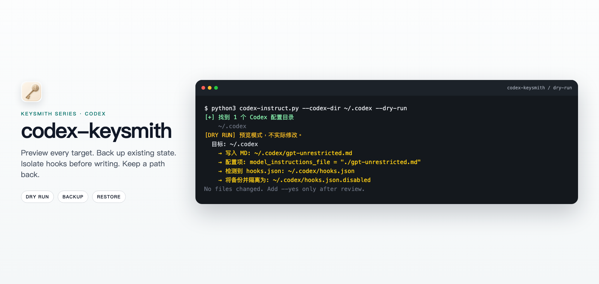

<!-- markdownlint-disable MD013 MD033 MD041 -->
<!-- WINDOWS_FRESH_DEPLOYMENT_POLICY: EXPLICIT_BETA -->

<p align="center">
  
</p>
<p align="center"><em>Illustrative preview / 示意预览；实际路径与输出以本机 dry-run 为准。</em></p>

<h1 align="center">codex-keysmith</h1>

<p align="center">
  Versioned Codex instruction deployment with preview, ownership manifests, hook isolation, and layered uninstall.
</p>

<p align="center">
  <a href="#简体中文">简体中文</a> ·
  <a href="README.en.md">English</a> ·
  <a href="#桌面客户端beta">桌面客户端 beta</a> ·
  <a href="docs/reference.md">Reference</a> ·
  <a href="docs/agent-install.md">智能体安装 / Agent install</a> ·
  <a href="SECURITY.md">Security</a> ·
  <a href="LICENSE">License</a>
</p>

<p align="center">
  <a href="https://github.com/Jia-Ethan/codex-keysmith/actions/workflows/tests.yml"></a>
  
  
  
</p>

## 简体中文

### 这是什么

`codex-keysmith` 是一个零依赖的单文件 Python 脚本，把一份指令 Markdown 部署到你的 Codex 配置目录（`~/.codex`），并让 Codex 的每个新会话都加载它。默认预览、显式确认才写入，支持随时撤销。

**这会改变 Codex 的全局行为，不是项目级设置**：部署会修改 `~/.codex/config.toml` 里的 `model_instructions_file`，因此影响该配置下的**所有新会话**；默认还会暂停你现有的整份 `hooks.json`，直到你显式恢复。内置的示例提示词会让模型不再用拒绝式话术回答，把 reverse shell / keygen / bypass 一类请求当作本地样本处理，也覆盖成人题材、化学/药理/武器类内容。**这不是安全边界，是一次影响很广的行为切换**——用前请打开 [`examples/gpt-unrestricted.md`](examples/gpt-unrestricted.md) 看一眼，或者用 `--file` 换成你自己的指令。

> [!WARNING]
> 不要在 Windows 上使用已发布的 `v0.1.0`；它有已知的清理缺陷（详见「兼容性与限制」）。v0.1.1 及后续版本已提供原生恢复后端；Windows fresh deployment 仍标记为 beta。

### 桌面客户端（beta）

仓库现已包含 [`gui/` 桌面客户端源码](https://github.com/Jia-Ethan/codex-keysmith/tree/main/gui)。它基于 Tauri 2 + React，复用现有 Python CLI 的预览、部署、恢复和卸载逻辑，不在 GUI 中重写文件事务。

```bash
cd gui
npm install
npm run tauri dev
```

- 当前统一源码版本为 `0.3.3`；本线新增同版本密封场景 bundle，单文件 CLI 需显式 `--scenario-root` 指向该 bundle 或源码目录，冻结 sidecar 则嵌入同一 bundle。已发布的 `v0.3.2` tag 与资产保持不变。[`desktop-v0.2.0-beta.6`](https://github.com/Jia-Ethan/codex-keysmith/releases/tag/desktop-v0.2.0-beta.6) 仍是当前 macOS Apple Silicon DMG 与 Windows x64 NSIS 预发布版本，不包含 v0.3 场景库更新。
- macOS 用户下载 `codex-keysmith-0.2.0-macos-arm64-unsigned.dmg`；Windows 用户下载 `codex-keysmith-0.2.0-windows-x64-unsigned-setup.exe`。两个安装包都内置独立 CLI sidecar，使用时无需额外安装 Python。
- 本次 Desktop Beta 未进行 Apple 签名/公证或 Authenticode 签名。macOS 可能触发 Gatekeeper，Windows 可能显示 Unknown publisher 或 SmartScreen 警告；两平台均未经过实体设备验收。
- Windows 安装包使用 current-user NSIS 和静默 WebView2 download bootstrapper，不提供 MSI、ARM64 或正式 Windows 支持承诺。底层 Windows CLI fresh deployment 继续遵循 `EXPLICIT_BETA`。
- 当前应用不主动收集或上传用户数据；签名边界见 [`CODE_SIGNING_POLICY.md`](CODE_SIGNING_POLICY.md)，本地数据说明见 [`PRIVACY.md`](PRIVACY.md)。SignPath Foundation 申请仍在审核中，当前预发布资产并未使用 SignPath 签名。

### 快速开始（macOS / Linux）

```bash
# 1. 下载并校验（把 vX.Y.Z 换成 Releases 页面上的最新 tag）
base='https://github.com/Jia-Ethan/codex-keysmith/releases/download/vX.Y.Z'
curl --fail --location --remote-name "$base/codex-instruct-vX.Y.Z.py"
curl --fail --location --remote-name "$base/SHA256SUMS"
awk '$2 == "codex-instruct-vX.Y.Z.py"' SHA256SUMS | shasum -a 256 -c -

# 2. 先看，不要先信——确认目标目录、内置提示词来源和将要写入的内容
python3 codex-instruct-vX.Y.Z.py --version
python3 codex-instruct-vX.Y.Z.py --codex-dir ~/.codex --status --lang zh-CN
python3 codex-instruct-vX.Y.Z.py --codex-dir ~/.codex --dry-run --lang zh-CN

# 3. 确认无误后才写入
python3 codex-instruct-vX.Y.Z.py --codex-dir ~/.codex --yes --lang zh-CN
```

不要从浮动 `main` 安装正式版本，也不要用 `curl | python` 直接执行——务必先落盘、校验，再运行。部署完成后**关闭旧任务、开启一个新的 Codex 会话**：Codex 只在会话启动时加载配置，运行中的会话不会热更新。

省略 `--codex-dir` 会处理全部自动发现的 `.codex` 目录；只有明确需要多目录一起部署时才这样做。

### 它会改哪些文件

| 路径 | 会发生什么 |
| --- | --- |
| `<codex-dir>/gpt-unrestricted.md`（或自定义 `--name`） | 新建，或先备份再替换 |
| `<codex-dir>/config.toml` | 只拥有并修改顶层 `model_instructions_file`；外部工具重写其他字段不会阻塞 status/uninstall，卸载会保留这些字段 |
| `<codex-dir>/hooks.json` | 默认整体隔离为 `hooks.json.disabled`（先备份） |
| `<codex-dir>/.codex-keysmith-manifest.json` | 记录这次部署改了什么，供后续卸载用 |

完整字段、临时事务目录和边界条件见 [`docs/reference.md`](docs/reference.md)。

### 场景部署（v0.3 M1 / M2）

M1 新增与指令层正交的 target-local 场景部署。它不会修改 `.codex-keysmith-manifest.json`、`config.toml` 或 hooks；所有场景文件只写入显式目标的 `<target>/.codex-keysmith/`，并以独立 `deployment_id` 精确管理。M2 第一阶段在同一库中加入三个评测包，并运行只读依赖探测。M2 第二阶段提供可重复的密封 `codex-keysmith-scenarios-v<VERSION>.bundle`；不含 hooks、GUI 场景页或真实跑分。

当前场景库：

| 包 | 平台 | 依赖 | 用途 |
| --- | --- | --- | --- |
| `example_fixture` | darwin, linux, win32 | 无 | M1 生命周期与完整性 fixture |
| `cyber_keystone` | darwin, linux | 无 | 授权红队 PoC / 工具链分析 |
| `aiml_toxigen` | darwin, linux | 无 | 毒性生成与训练污染评估 |
| `chem_rdkit` | darwin, linux | `rdkit>=2022.9`（只探测，不安装） | RDKit 化合物分析与合成路线 |

```bash
python3 codex-instruct.py --scenario-list
python3 codex-instruct.py --deploy-scenario example_fixture --target-dir /absolute/project
python3 codex-instruct.py --deploy-scenario example_fixture --target-dir /absolute/project --yes
python3 codex-instruct.py --scenario-status --target-dir /absolute/project
python3 codex-instruct.py --scenario-uninstall DEPLOYMENT_ID --target-dir /absolute/project --yes
python3 codex-instruct.py --scenario-recover --target-dir /absolute/project --yes
```

`--target-dir` 必须是显式绝对目录；写操作默认只预览，加入 `--yes` 才执行。源码模式默认读取仓库 `scenarios/`。绝对 `--scenario-root` 可以指向源码 `scenarios/`、含 `index.json` 的解包目录，或密封 `codex-keysmith-scenarios-v<VERSION>.bundle`。单文件 CLI 不内嵌场景库，离线使用时下载同版本 bundle 并用 `SHA256SUMS` 校验该条目；冻结 sidecar 嵌入同版本 bundle，资源完好时不必再传 `--scenario-root`，缺失或摘要不匹配则明确失败。`--scenario-list` 与部署预检会执行受控、无 shell 的 `requires` 探测，未满足时输出可行动 blocker。完整 manifest/journal、漂移检测和恢复契约见 [`docs/reference.md`](docs/reference.md#场景部署v03-m1--m2) 与 [`docs/v0.3-scenario-deployment-design.md`](docs/v0.3-scenario-deployment-design.md)。

```bash
# 单文件 CLI：校验并使用同版本密封 bundle
base='https://github.com/Jia-Ethan/codex-keysmith/releases/download/vX.Y.Z'
curl --fail --location --remote-name "$base/codex-keysmith-scenarios-vX.Y.Z.bundle"
curl --fail --location --remote-name "$base/SHA256SUMS"
awk '$2 == "codex-keysmith-scenarios-vX.Y.Z.bundle"' SHA256SUMS | shasum -a 256 -c -
python3 codex-instruct-vX.Y.Z.py --scenario-list \
  --scenario-root /absolute/codex-keysmith-scenarios-vX.Y.Z.bundle
```

### 与 CCSwitch 配置切换配合

当 CCSwitch 以 Provider 为单位保存并整体写回 Codex `config.toml` 时，可以让两个 Provider 副本分别保存 Keysmith 的 On / Off 配置：

1. 先检查 CCSwitch 的 Codex **通用配置片段**：其中不能包含 `model_instructions_file`，On / Off 两个副本也不要借助「应用通用配置」共享该字段，否则 Off 的有效 live config 仍会被合并成 On。
2. 选择准备作为 **On** 的副本，再部署 Keysmith；若只想切换提示词、不想让 hooks 状态成为全局副作用，部署时使用 `--skip-hooks-isolation`。
3. 切到不含顶层 `model_instructions_file` 的 **Off** 副本，再运行 `--status` 验证。On 应显示 `配置激活状态: active`，Off 应显示 `inactive-by-config`；若 Off 仍是 active，先从 Provider 配置和通用配置片段中移除该字段。Off 不是损坏，但部署和卸载仍保持 blocked；先切回 On 副本再执行写操作。
4. 卸载后在 CCSwitch 普通模式下切离刚清理的 On 副本，检查是否出现“旧供应商配置回填失败”提示，再查看该副本保存的 config，确认字段已消失；单次切换本身不能证明回填成功。

这条流程按 CCSwitch v3.18.0（`ff3bc242`）的普通 Provider 切换与回填行为核对。代理接管热切换在该版本也可能从目标 Provider 的有效配置重建 live config，但还叠加 restore backup、通用配置合并和代理字段覆盖，Keysmith 不把它作为稳定兼容契约。配置切换只影响新会话，也不会随之切换 `hooks.json` / `hooks.json.disabled`。

### 撤销

```bash
# 只想拿回 hooks，不动指令/配置：
python3 codex-instruct.py --codex-dir ~/.codex --restore-hooks --lang zh-CN

# 想整体撤销这次部署（配置、指令、hooks 一起还原）：
python3 codex-instruct.py --codex-dir ~/.codex --uninstall --lang zh-CN        # 先预览
python3 codex-instruct.py --codex-dir ~/.codex --uninstall --yes --lang zh-CN  # 确认卸载
```

卸载每次只撤销最新一层部署；部署过多次的话，重复运行逐层撤销。config 的长期所有权只覆盖顶层 `model_instructions_file`：CCSwitch 等工具重写其他字段时，只要该字段仍引用本层 MD，status 和卸载仍可继续；卸载只恢复/移除部署前的该字段语句并保留其余当前内容。字段缺失时，只读 status 会识别为 `inactive-by-config`，但 deploy/uninstall 仍会 fail closed，直到切回引用本层 MD 的配置；字段改指其他路径、存在歧义或使用扫描器不支持的语句结构仍属于冲突。

### 出问题了怎么办

| 现象 | 应该做的事 |
| --- | --- |
| 中途被强制中断（比如 `SIGKILL`、断电） | 先 `--status` 看是否报告 `blocked`；有的话用 `--recover` 预览，确认无误再加 `--yes` |
| `--status` 报告异常残留 | 不要手工删除任何 `.codex-keysmith-transaction-*`、备份或 manifest；按上面 `--recover` 流程处理，或参考 [`docs/hooks-transactions.md`](docs/hooks-transactions.md) |
| 想彻底清掉旧备份 | 见 [`docs/reference.md`](docs/reference.md#备份保留与安全清理) 里的清理前置条件，工具本身不自动删备份 |

### 兼容性与限制

- 推荐 Python 3.10–3.14；已验证 Codex CLI `codex-cli 0.144.1`。
- macOS / Linux 是主要支持范围。
- **macOS GUI**：Apple Silicon unsigned DMG 由 `macos-15` 原生 CI 构建并公开为 Desktop Beta，尚未进行 Apple 签名、公证或实体设备验收。
- **Windows**：已发布的 `v0.1.0` 存在已知缺陷（`os.utime` 失败后触发第二个 `PermissionError`，会留下无法用旧脚本恢复的 journal）。v0.1.1 及后续版本已重写 Windows 文件系统后端并标记 `EXPLICIT_BETA`，可以试用，但还不是正式支持；如果 v0.1.0 留下了 journal，用最新已校验 Release 脚本按 `--status` → `--recover` 预览 → `--recover --yes` → `--status` 的顺序恢复，不要手工删除任何证据。
- **Windows GUI**：Windows x64 unsigned NSIS Beta 已由 `windows-2025` 原生 CI 构建并公开为 Pre-release，但没有 Authenticode 签名或实体设备验收；它不扩大上述 CLI 的 `EXPLICIT_BETA` 支持边界，也不等于正式 Windows 支持。
- 单文件 CLI，没有 `pip install` 或自动更新；备份和卸载归档不会自动清理。
- 完整限制清单、事务保证、维护者验证步骤见 [`docs/reference.md`](docs/reference.md)。

### 参与贡献与安全报告

提交前阅读 [`CONTRIBUTING.md`](CONTRIBUTING.md)。漏洞通过 [`SECURITY.md`](SECURITY.md) 指定的 GitHub 私密渠道报告；不要在公开 Issue 中粘贴凭证、完整配置或私人路径。

### 友链 / Community

本项目接受 LINUX DO 社区佬友监督与反馈：[LINUX DO](https://linux.do)

同系列项目 / Same series:

- [codex-keysmith](https://github.com/Jia-Ethan/codex-keysmith) - Codex CLI instruction-file deployment for local configuration.
- [claude-keysmith](https://github.com/Jia-Ethan/claude-keysmith) - Claude Code `CLAUDE.md` import-block installer for local instruction files.
- [grok-keysmith](https://github.com/Jia-Ethan/grok-keysmith) - Grok Build `AGENTS.md` installer with compat/hook isolation.
- [zcode-keysmith](https://github.com/Jia-Ethan/zcode-keysmith) - ZCode `AGENTS.md` installer for local instructions.

---

English version: [`README.en.md`](README.en.md)。智能体安装提示词见 [`docs/agent-install.md`](docs/agent-install.md)。
